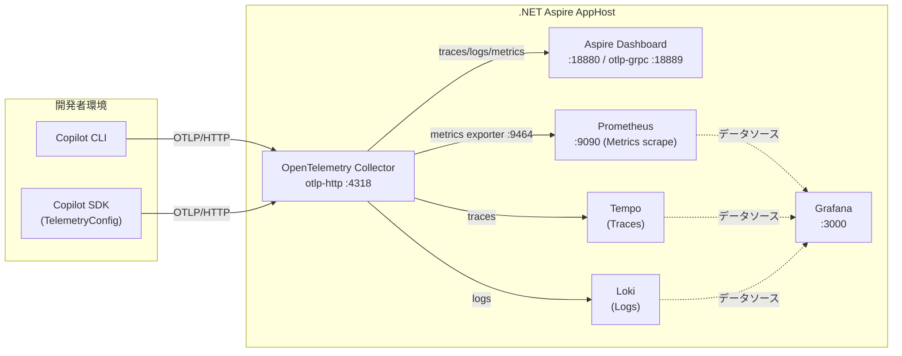

# OpenTelemetryを使った可観測性

## Overview

今回はGitHub Copilot CLIとOpenTelemetryを組み合わせて、アプリケーションの可観測性を向上させる方法について説明します。また、モデルルーティングの可観測性についても触れます。

可観測性にはOpenTelemetry、Aspire、Prometheus、Grafana、Tempo、Lokiを組み合わせて利用し
リクエストされたモデルやレスポンスに対応したモデルを可観測性の対象として追跡します。

また、モデルルーティングの可観測性を考えるべく、OpenTelemetryを用いてHydraFusionがどのような動作をしているかを追跡して可視化し、
そして、可視化を通して、モデルルーティングの有無でAIエージェントが組み込まれたアプリケーション全体がどのように動作するのかを計測します。

## 前提条件

本構成を再現する場合は、以下のバージョンを基準にしてください。

| コンポーネント | バージョン | 確認方法・出典 |
| :--- | :--- | :--- |
| GitHub Copilot CLI | 1.0.91 | `copilot --version`（[README.md](../README.md)参照） |
| GitHub Copilot SDK (Python) | 0.2.3 | [`python/pyproject.toml`](../python/pyproject.toml)の`github-copilot-sdk==0.2.3` |
| .NET SDK | 10.0.401（`net10.0`ターゲット） | `dotnet --version` / [`AspireHost.csproj`](./AspireHost/AspireHost.csproj)の`TargetFramework` |
| .NET Aspire | 13.6.1 | [`AspireHost.csproj`](./AspireHost/AspireHost.csproj)の`Aspire.AppHost.Sdk/13.6.1` |

> 注意: Copilot CLI/SDKのバージョンは更新頻度が高いため、最新情報は都度`copilot --version`やインストール済みパッケージで確認してください。

## Observability Tools

- [OpenTelemetry](https://opentelemetry.io/)
- [Aspire](https://aspire.dev/)
- [Prometheus](https://prometheus.io/)
- [Grafana](https://grafana.com/)
- [Tempo](https://grafana.com/oss/tempo/)
- [Loki](https://grafana.com/oss/loki/)

## インフラ構成図

構成を箇条書きで示すと以下の通りです。

- Copilot CLI/SDK がOTLP/HTTPで OpenTelemetry Collector にトレース・ログ・メトリクスを送信します。
- Collector は受信したシグナルを Aspire Dashboard に転送しつつ、トレースは Tempo、ログは Loki へ、メトリクスはPrometheus exporter（`otel-collector:9464`）経由で Prometheus へ転送します。
- Grafana はTempo・Loki・Prometheusをデータソースとして登録しており、Explore画面から3シグナルを横断的に参照できます。

Aspire AppHostが起動するコンテナー群とCopilot CLI/SDKからのテレメトリの流れを構成図として示すと以下の通りです。



GrafanaはTempo、Loki、Prometheusをデータソースとして使用するため、3シグナルをAspireとGrafanaの両方で参照できます。設定ファイルはAppHostの出力先にコピーしてコンテナーへ読み取り専用でマウントするため、起動時の作業ディレクトリに依存しません。

`GF_SECURITY_ADMIN_PASSWORD`はローカル検証用の値です。共有環境では秘密情報に置き換えてください。また、匿名アクセスを有効にしているAspire Dashboardは開発用ネットワークだけで使用してください。

## .NET10ですぐに可視化環境を構築する

`AspireHost/`に .NET Aspire AppHostを追加しています。.NET 10 SDKと起動済みのDockerが必要です。

リポジトリのルートから実行する場合は以下のコマンドでAspireのAppHostを起動します。

```bash
dotnet run --project OpenTelemetry/AspireHost
```

なお、すでに`OpenTelemetry/AspireHost`ディレクトリがカレントディレクトリに設定されている場合は以下のコマンドでAspireのAppHostを起動します。

```bash
dotnet run
```

実行結果

```text
AppHost:  AspireHost.csproj
Dashboard:  https://localhost:43863/login?t=3c1f62e125335ae38074f7a01d8e2ff0
Logs:  /home/vscode/.aspire/logs/cli_20261010T125202_3c4641e6.log 

Endpoints:  otel-dashboard has endpoint http://localhost:18880   
            otel-dashboard has endpoint http://localhost:18889   
            grafana has endpoint http://localhost:3000           
            otel-collector has endpoint http://localhost:4318    
            prometheus has endpoint http://localhost:9090        
            Press CTRL+C to stop the AppHost and exit.   
```

※このときに表示されるエンドポイント情報はダッシュボードのアクセス先になるため、ブラウザでアクセスする際の参考にしてください。

Aspire Dashboard、OpenTelemetry Collector、Prometheus、Grafana、Tempo、Lokiをコンテナーとして起動します。Copilot CLI/SDKから送るOTLPはCollectorが受信し、トレースをAspire DashboardとTempo、ログをAspire DashboardとLoki、メトリクスをAspire DashboardとPrometheusへ転送します。

## Copilot CLIの設定

Python SDKを初めて使用する場合は、SDKの実行に必要なCopilot CLIランタイムを一度ダウンロードする必要があります。ダウンロードを行うには
別のターミナルを起動して以下のコマンドを実行してください。

```bash
python -m copilot download-runtime
```

実行結果

```text
Downloading Copilot runtime v1.0.95...
Runtime cached at: /home/vscode/.cache/github-copilot-sdk/cli/1.0.95/prebuilds/linux-x64/copilot-runtime
```

## Copilot CLIの起動と接続

では、実際にCopilot CLIとAspire AppHostを接続してテレメトリを送信し、可視化環境を確認してみましょう。
Copilot CLIからCollectorへ送信する場合は、CLIを起動する前に次を設定します。

`OTEL_EXPORTER_OTLP_ENDPOINT`はAspire AppHost内のDashboardではなく、OTLP/HTTPを受け付けるCollectorのURLです。SDKでは`TelemetryConfig`のOTLP endpointに同じ`http://localhost:4318`を指定します。

```bash
export COPILOT_OTEL_ENABLED=true
export OTEL_EXPORTER_OTLP_ENDPOINT=http://localhost:4318
```

Copilot CLIを起動します。

```bash
copilot
```

これでCopilot CLIからCollectorへテレメトリを送信する準備が整いました。

### 実験的な機能を有効にする

実験的な機能を有効にするにはCopilot CLIのスラッシュコマンドで`/experimental on`を実行します。

Aspire Dashboardは<http://localhost:18880>で開くことができ、Aspire Dashboardでは各シグナルの画面、GrafanaではExploreを開いて対応するデータソースを選択します。

可視化ツールがAspire Dashboard、Grafana、Prometheus、Tempo、Lokiで構成されていますので順番に見ていきましょう。

## Aspire DashboardでCopilot CLIの動きを観測する

まずはAspire Dashboardを確認します。Aspire Dashboardは<http://localhost:18880>で開くことができ、トレース、ログ、メトリクスの3シグナルを一元的に可視化できます。Aspire DashboardのUIは、トレース、ログ、メトリクスの各画面にアクセスできるタブで構成されており、各シグナルの詳細を確認できます。

## PrometheusでCopilot CLIの動きを観測する

次にPrometheusです。Prometheusは<http://localhost:9090>は開きます。

CollectorはPrometheus exporterを`otel-collector:9464`で公開し、Prometheusが15秒ごとにメトリクスをscrapeします。scrapeの設定は[`prometheus.yml`](./prometheus.yml)、Collectorのexporter設定は[`otel-collector.yaml`](./otel-collector.yaml)を参照してください。

PrometheusのUI: <http://localhost:9090>。`up{job="otel-collector"}`を実行すると、Collectorのexporterがscrapeできているか確認できます。Copilot CLI/SDKのメトリクスを表示するには、下記の「起動と接続」にあるTelemetry設定を行ってください。

## Grafana、Tempo、LokiでCopilot CLIの動きを観測する

最後にGrafanaです。Grafanaは<http://localhost:3000>で開きます。Grafanaのユーザー名は`admin`、初期パスワードは`change-me`です。

Grafanaは起動時にPrometheus、Tempo、Lokiをデータソースとして登録します。設定は[`grafana-datasources.yaml`](./grafana-datasources.yaml)を参照してください。

Grafana: <http://localhost:3000>（ユーザー名`admin`、パスワードはAppHostの`GF_SECURITY_ADMIN_PASSWORD`）

GrafanaのExploreで、メトリクスはPrometheus、トレースはTempo、ログはLokiを選択します。TempoとLokiのローカルストレージはコンテナー内にあり、スタックを削除するとデータも削除されます。

## 参考

- [opentelemetry-monitoring](https://docs.github.com/en/copilot/reference/copilot-cli-reference/cli-command-reference#opentelemetry-monitoring)
- [OpenTelemetry instrumentation for Copilot SDK](https://docs.github.com/en/copilot/how-tos/copilot-sdk/observability/opentelemetry)
- [AspireのコンテナーリソースAPI](https://aspire.dev/reference/api/csharp/aspire.hosting/containerresourcebuilderextensions/methods/)
- [Enterprise-managed OpenTelemetry export for VS Code and CLI](https://github.blog/changelog/2026-07-08-enterprise-managed-opentelemetry-export-for-vs-code-and-cli/)
- [Add Telemetry Endpoint Support](https://github.com/github/copilot-cli/issues/1565)
- [Managed telemetry.headers prevents OpenTelemetry (OTEL) export](https://github.com/github/copilot-cli/issues/4669)
- [Feature Request: Enterprise OTel auth — mTLS env vars + dynamic-headers helper (parity with Claude Code)](https://github.com/github/copilot-cli/issues/3477)
- [Dynamic workflows in Copilot CLI and the Copilot app](https://github.blog/changelog/2026-10-01-dynamic-workflows-in-copilot-cli-and-the-copilot-app/)

- [hydrafusion-traces](https://github.com/samueltauil/hydrafusion-traces/blob/main/docs/SPIKE.md)
